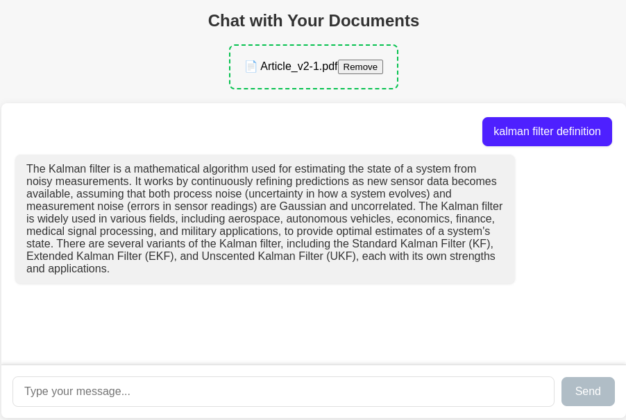

# Chat with Your Documents

一个基于 React + FastAPI 的本地文档问答 Demo。你可以上传 PDF，后端会对文档做切分、向量化和相似度检索，再调用 DeepSeek API 生成回答。

当前版本已经从 Together API 切换为 DeepSeek API。



## 项目简介

这个项目的核心流程是：

1. 前端上传 PDF 文件
2. 后端使用 `PyPDFLoader` 读取文档内容
3. 使用 `sentence-transformers/all-mpnet-base-v2` 生成向量
4. 将向量保存到本地 FAISS 向量库
5. 用户提问时，从向量库检索相关片段
6. 将检索结果发送给 DeepSeek 模型生成回答

这是一个偏学习和演示性质的 RAG 项目，适合快速理解“文档上传 + 检索增强问答”的基本链路。

## 技术栈

### 前端

- React
- Vite
- styled-components
- axios
- react-dropzone

### 后端

- FastAPI
- OpenAI Python SDK
- DeepSeek API
- LangChain
- FAISS
- HuggingFace Embeddings
- PyPDF

## 当前功能

- 上传 PDF 文档
- 将文档切分并写入本地向量库
- 基于文档内容进行问答
- 前后端本地联调
- DeepSeek 模型回答

## 当前限制

在开始使用前，建议先了解这几个限制：

- 目前只支持 `PDF`，不支持 `docx`
- 多次上传的文档会合并进同一个向量库，不做文件级隔离
- 前端界面较简单，错误提示不够友好
- 检索逻辑比较基础，不适合直接做高质量整篇论文综述
- 仓库目前没有 `requirements.txt`，后端依赖需要手动安装

## 目录结构

```text
Chat-with-Your-Documents-master/
├─ backend_chatdoc.py          # FastAPI 后端入口
├─ front-chatdoc/              # React 前端
├─ images/
│  └─ app.png
├─ .env                # 环境变量
├─ 启动说明.md                 # 更详细的本地启动说明
└─ README.md
```

## 运行环境

推荐环境：

- Node.js 18+
- npm 9+
- Python 3.10 或 3.11
- Windows / macOS / Linux 均可，本文示例偏向 Windows PowerShell

说明：

- 你当前如果使用 `conda`，优先推荐创建 `Python 3.10` 环境
- 由于 `faiss` 和部分 NLP 依赖在不同 Python 版本上的兼容性存在差异，不建议优先使用过新的 Python 版本

## 1. 克隆项目

```bash
git clone https://github.com/wwkkmmnn/Chat-with-Your-Documents-master.git
cd Chat-with-Your-Documents
```

如果你当前已经在本地目录中，直接进入项目根目录即可。

## 2. 配置后端环境

### 方案 A：使用 conda

```powershell
conda create -n chatdoc python=3.10 -y
conda activate chatdoc
```

如果 PowerShell 里无法激活 conda 环境，先执行：

```powershell
conda init powershell
```

然后关闭当前终端，重新打开再执行：

```powershell
conda activate chatdoc
```

### 方案 B：使用 venv

```powershell
python -m venv .venv
.\.venv\Scripts\Activate.ps1
```

## 3. 安装后端依赖

项目当前没有提供 `requirements.txt`，请先手动安装：

```powershell
pip install fastapi "uvicorn[standard]" python-dotenv openai langchain langchain-community langchain-huggingface langchain-text-splitters sentence-transformers pypdf python-multipart faiss-cpu
```

如果安装 `faiss-cpu` 失败，优先检查：

- Python 版本是否过高
- 是否在干净的虚拟环境中安装
- 是否需要切换到 Python 3.10 / 3.11

## 4. 配置环境变量

在项目根目录创建 `.env` 文件：

```env
DEEPSEEK_API_KEY=your_deepseek_api_key
DEEPSEEK_MODEL=deepseek-chat
```

可选变量：

```env
DEEPSEEK_BASE_URL=https://api.deepseek.com
```

说明：

- `DEEPSEEK_API_KEY` 必填
- `DEEPSEEK_MODEL` 默认可用 `deepseek-chat`
- 如果你想尝试推理模型，可以改成 `deepseek-reasoner`

## 5. 启动后端

在项目根目录执行：

```powershell
uvicorn backend_chatdoc:app --host 0.0.0.0 --port 8000 --reload
```

启动成功时，通常会看到类似输出：

```text
Uvicorn running on http://0.0.0.0:8000
Application startup complete.
```

说明：

- 首次启动可能会下载 HuggingFace 模型，速度可能较慢
- 如果看到 `HF Hub unauthenticated requests`，只是提示你没配 `HF_TOKEN`，不影响基本运行

## 6. 启动前端

打开新的终端窗口：

```powershell
cd front-chatdoc
npm install
npm run dev
```

默认前端地址：

```text
http://localhost:5173
```

## 7. 使用方式

1. 先启动后端，再启动前端
2. 在浏览器打开 `http://localhost:5173`
3. 上传一个 PDF 文件
4. 等待后端完成处理
5. 在输入框中提问

建议优先提这类问题：

- 这篇论文的研究目标是什么？
- 论文用了哪些数据集？
- 作者的方法和基线方法有什么区别？
- 这篇文档的结论是什么？

不建议一开始就提：

- 详细分析整篇论文
- 完整总结全文并逐章解释

原因是当前项目的检索逻辑较基础，一次只取较少片段，做“整篇深度综述”效果通常一般。

## 8. 接口说明

### `POST /upload/`

上传 PDF 文档。

请求：

- `multipart/form-data`
- 字段名：`file`

### `POST /query/`

根据向量检索结果生成回答。

请求体：

```json
{
  "question": "这篇论文的核心方法是什么？"
}
```

## 9. 常见问题

### 1. 上传文件后没有回答

先检查：

- 上传的是不是 PDF
- 后端是否正常运行在 `8000`
- `.env` 中是否配置了 `DEEPSEEK_API_KEY`

### 2. 前端显示文件了，但后端其实没处理成功

这是当前前端实现的已知问题。前端会先显示文件名，再执行上传，所以视觉上可能像是“上传成功”，但实际上后端已经报错。

### 3. 问“详细分析论文”时回答很差

不是一定因为模型太弱，更常见的原因是：

- 检索片段不够
- PDF 提取文本质量一般
- 系统提示词限制了模型只能基于局部上下文回答

### 4. 后端启动时报 LangChain 导入错误

请确认已经安装：

```powershell
pip install langchain-text-splitters
```

### 5. 后端启动时报 API Key 错误

请确认你创建的是 `.env`，不是只保留 `.env.example`。

## 10. 已知问题

- 向量库使用全局状态，存在文档串味问题
- 初始向量库会写入占位文本，可能影响早期检索结果
- 前端没有展示检索来源
- 前端错误提示较粗糙
- `uvicorn --reload` 在监听整个仓库时，前端目录变化也可能触发后端重启

## 11. 后续可改进方向

- 增加 `docx` 支持
- 将向量库按文件或会话隔离
- 优化前端上传与错误提示
- 展示引用来源和检索片段
- 增加 `requirements.txt`
- 提供 Docker 部署方案
- 优化面向论文分析的提示词和检索策略

## 12. 相关文件

- [backend_chatdoc.py](./backend_chatdoc.py)
- [front-chatdoc/src/App.jsx](./front-chatdoc/src/App.jsx)
- [front-chatdoc/src/components/FileUpload.jsx](./front-chatdoc/src/components/FileUpload.jsx)
- [front-chatdoc/src/components/ChatInterface.jsx](./front-chatdoc/src/components/ChatInterface.jsx)
- [启动说明.md](./启动说明.md)

## License

MIT
